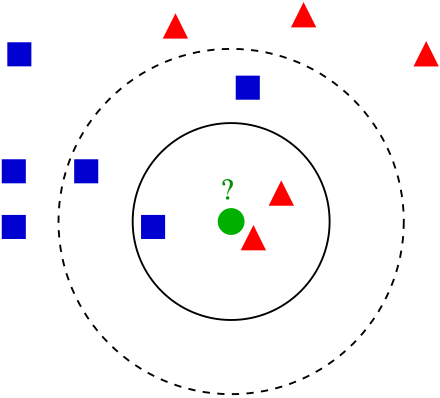
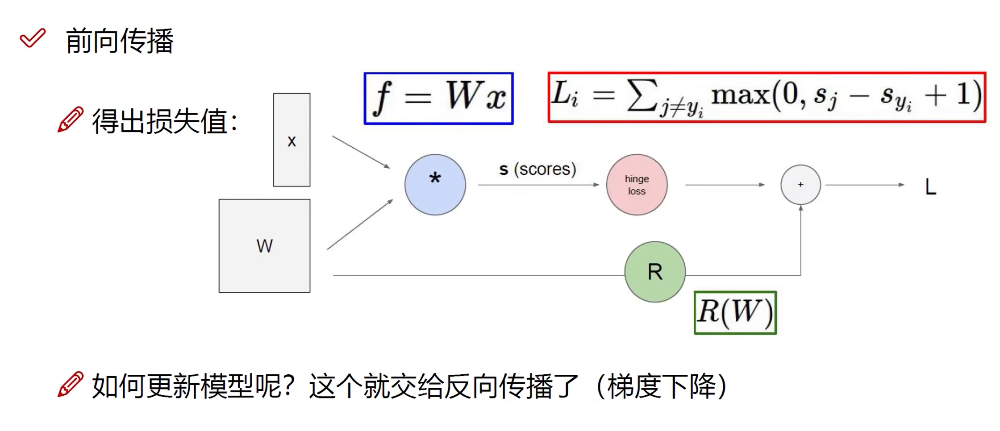
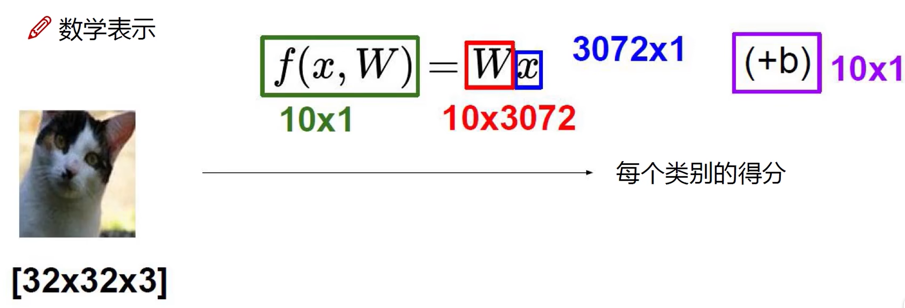
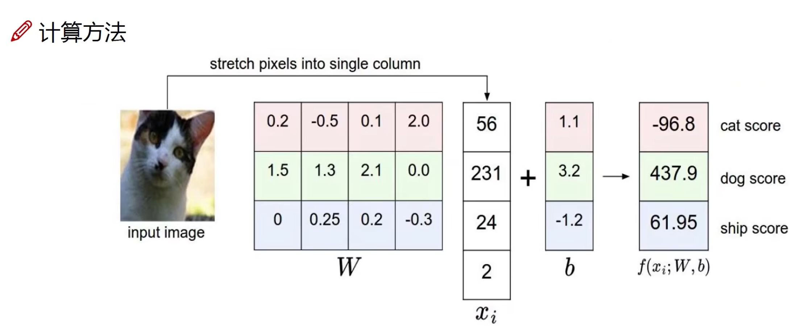
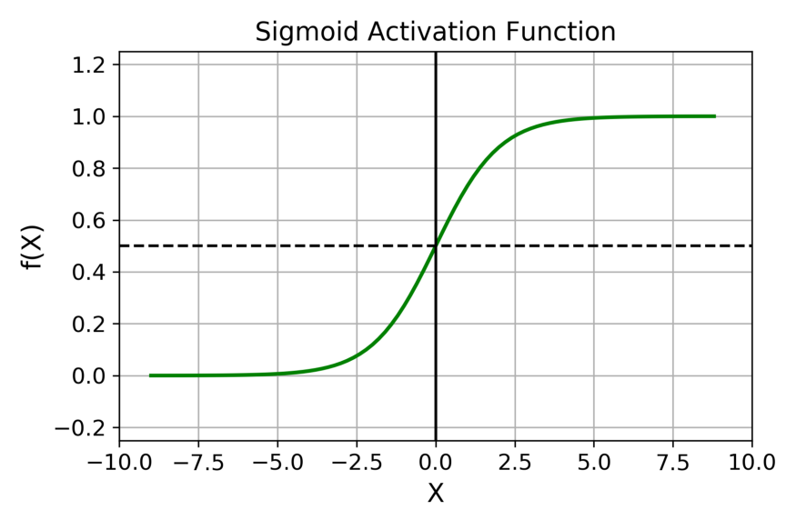
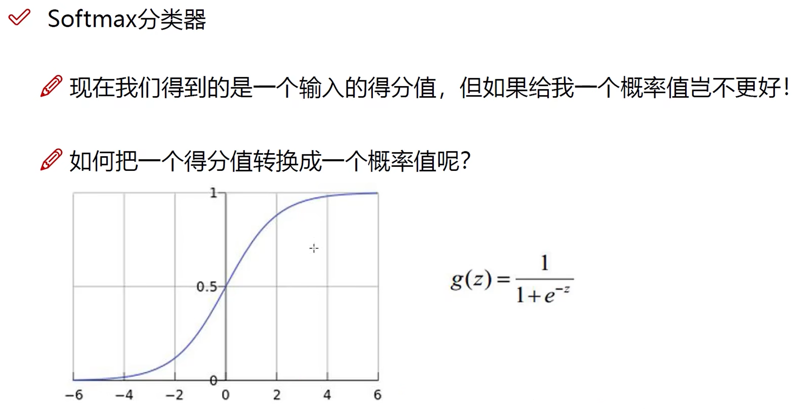
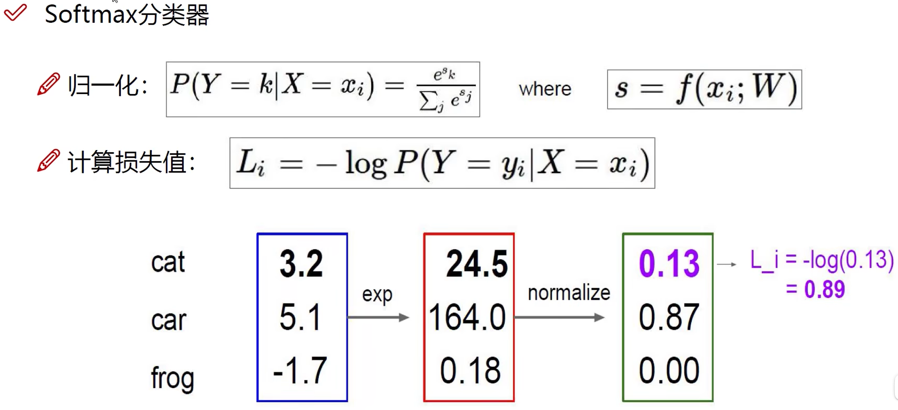
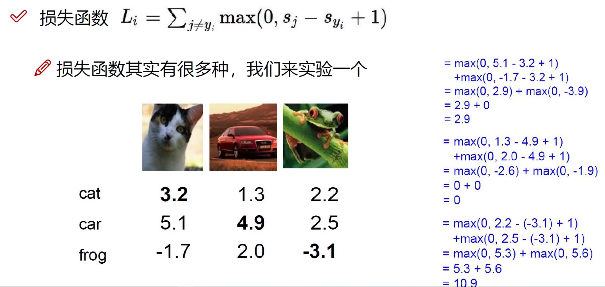
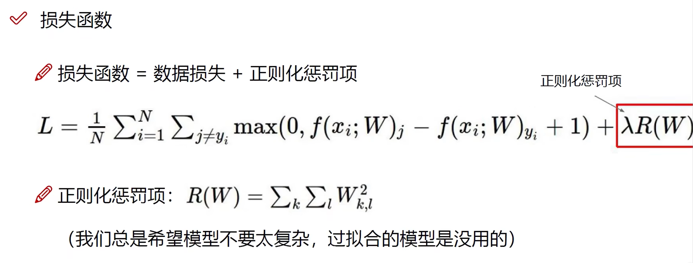

# 计算机视觉任务

### 数据集

1. IMAGENET：数据量较大
2. CIFAR-10：数据量较小

数据集扩充：旋转、遮蔽

### 机器学习常规套路

1. 收集数据，给定标签
2. 训练分类器
3. 测试，评估

### K-近邻算法（KNN）

k近邻算法，也称为KNN 或k-NN，是**一种非参数、有监督的学习分类器，KNN 使用邻近度对单个数据点的分组进行分类或预测**。 虽然k近邻算法(KNN) 可以用于回归或分类问题，但它通常用作分类算法，假设可以在彼此附近找到相似点。 对于分类问题，**根据多数票分配类别标签**，也就是使用在给定数据点周围最常表示的标签。

#### 计算过程

1. 计算已知类别数据集中的点与当前点的距离
2. 按照距离依次排序
3. 选取与当前点距离最小的 K 个点
4. 确定前 K 个点所在类别的出现概率
5. 返回前 K 个点出现频率最高的类别作为当前点预测分类

#### 在图像处理中的局限性

背景主导是最大的问题，我们关注的是主体。

## 神经网络：前向传播

### 整体概述

神经网络是一种模拟人脑神经元网络的计算模型，广泛应用于机器学习和深度学习领域。下面将从神经网络的基本结构和各个组件的功能出发，顺序讲解其运算过程。

#### 1. 输入层 (Input Layer)

输入层是神经网络的起点，用于接收输入数据。每个节点（神经元）代表输入数据的一个特征。比如在图像识别中，输入层的节点可能对应于图像的每个像素值。

#### 2. 隐藏层 (Hidden Layers)

隐藏层位于输入层和输出层之间，可以有一个或**多个**。隐藏层的节点数可以自行设定，这些节点通过连接权重与前一层和后一层的节点相连。

**计算过程**

##### a. 得分函数 (Score Function)

在隐藏层和输出层中，每个节点都会计算其“得分”，即该节点的激活值。得分函数通常是加权求和再加上偏置项。具体来说，对于第 $j$ 个隐藏层节点，其得分计算公式为：
$$
z_j = \sum_{i=1}^{n} w_{ji} x_i + b_j
$$
其中，$w_{ji}$ 是权重，$ x_i $ 是前一层第 $i$ 个节点的输出，$ b_j $ 是偏置项。

##### b. 激活函数 (Activation Function)

得分函数的输出会通过激活函数进行非线性变换，激活函数帮助模型捕捉非线性关系。常见的激活函数有：
- **Sigmoid**: $ \sigma(z) = \frac{1}{1 + e^{-z}} $
- **ReLU (Rectified Linear Unit)**: $ \text{ReLU}(z) = \max(0, z) $
- **Tanh**: $ \tanh(z) = \frac{e^z - e^{-z}}{e^z + e^{-z}} $

#### 3. 输出层 (Output Layer)

输出层是神经网络的最后一层，其节点数和任务相关。对于分类任务，输出层的节点数通常等于类别数，每个节点代表一个类别的概率。对于回归任务，输出层通常只有一个节点，输出预测值。

#### 4. 损失函数 (Loss Function)

损失函数用于衡量模型预测值与实际值之间的差距，常见的损失函数有：

- **均方误差 (MSE, Mean Squared Error)**：用于回归任务，公式为：
  $$
  \text{MSE} = \frac{1}{n} \sum_{i=1}^{n} (y_i - \hat{y}_i)^2
  $$
  其中，$ y_i $ 是实际值，$ \hat{y}_i $ 是预测值。

- **交叉熵损失 (Cross-Entropy Loss)**：用于分类任务，公式为：
  $$
  \text{Cross-Entropy} = -\sum_{i=1}^{n} y_i \log(\hat{y}_i)
  $$
  其中，$ y_i $ 是实际类别的指示函数，$ \hat{y}_i $ 是预测的概率值。

#### 5. 反向传播 (Backpropagation)

为了减少损失函数值，神经网络会进行反向传播，调整权重和偏置项。反向传播利用梯度下降算法，通过计算损失函数相对于每个权重的梯度，逐层更新权重：
$$
w_{ji} \leftarrow w_{ji} - \eta \frac{\partial \text{Loss}}{\partial w_{ji}}
$$
其中，$ \eta $ 是学习率。

#### 6. 迭代训练

上述过程会在训练数据上进行多次迭代，每次迭代（称为一个epoch）都会更新网络参数，使模型逐渐收敛到一个较优的解，从而提升预测性能。

总结起来，神经网络通过输入层接收数据，隐藏层进行复杂特征提取和变换，输出层生成最终预测结果，损失函数衡量预测误差，反向传播更新权重，从而实现模型的训练和优化。

### 线性函数（得分函数）

从输入到输出的映射。

x: image	W: parameter，每行代表一个类别	b: 偏置，微调对象

函数结果为 10x1 矩阵，每个元素代表一个类别的得分。

一般情况下，x会经过不止一个W。

### 激活函数

人工神经网络中节点的激活函数是一种**根据节点的各个输入及其权重计算节点输出的函数**。如果激活函数是非线性的，则可以仅使用少数节点解决非平凡的问题。

激励函数一般用于神经网络的层与层之间，上一层的输出通过激励函数的转换之后输入到下一层中。神经网络模型是非线性的，如果没有使用激励函数，那么每一层实际上都相当于矩阵相乘。经过非线性的激励函数作用，使得神经网络有了更多的表现力。

#### Sigmoid

在什么情况下适合使用 Sigmoid 激活函数呢？

- Sigmoid 函数的输出范围是 0 到 1。由于输出值限定在 0 到 1，因此它对每个神经元的输出进行了归一化；
- 用于将预测概率作为输出的模型。由于概率的取值范围是 0 到 1，因此 Sigmoid 函数非常合适；
- 梯度平滑，避免「跳跃」的输出值；
- 函数是可微的。这意味着可以找到任意两个点的 sigmoid 曲线的斜率；
- 明确的预测，即非常接近 1 或 0。

Sigmoid 激活函数有哪些缺点？

- 倾向于梯度消失；
- 函数输出不是以 0 为中心的，这会降低权重更新的效率；
- Sigmoid 函数执行指数运算，计算机运行得较慢。

#### Softmax

Softmax函数可以将上一层的原始数据进行归一化，转化为一个【0,1】之间的数值，这些数值可以被当做概率分布，用来作为多分类的目标预测值。Softmax函数一般作为神经网络的最后一层，接受来自上一层网络的输入值，然后将其转化为概率。**之所以要选用e作为底数的指数函数来转换概率，是因为上一层的输出有正有负，采用指数函数可以将其第一步都变成大于0的值，然后再算概率分布**。

### 损失函数

损失函数（loss function）或代价函数（cost function）是**将随机事件或其有关随机变量的取值映射为非负实数以表示该随机事件的“风险”或“损失”的函数**。 在应用中，损失函数通常作为学习准则与优化问题相联系，即通过最小化损失函数求解和评估模型。

损失函数有很多种，下面是一些例子。

#### Hinge Loss

### 正则化：损失函数的改进

正则化（regularization）是机器学习中**用于防止模型过拟合（overfitting）的一种技术**。 正则化的主要目的是限制模型的复杂度，以减少过拟合的风险，即模型在训练数据上表现得很好，但在新的、未见过的数据上表现不佳的现象。 通过在损失函数中添加一个正则项，可以缩小解空间，从而减少求出过拟合解的可能性。

## 神经网络：反向传播

**反向传播**（英语：Backpropagation，缩写为BP）是“误差反向传播”的简称，是一种与最优化方法（如**梯度下降法**）结合使用的，用来训练人工神经网络的常见方法。该方法计算对网络中所有权重计算损失函数的梯度。这个梯度会反馈给最优化方法，用来更新权值以最小化损失函数。 在神经网络上执行梯度下降法的主要算法。该算法会先按前向传播方式计算（并缓存）每个节点的输出值，然后再按反向传播遍历图的方式计算损失函数值相对于每个参数的偏导数。

